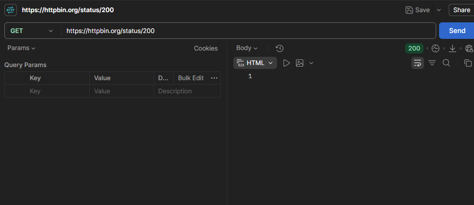
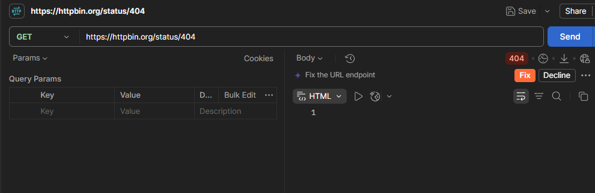
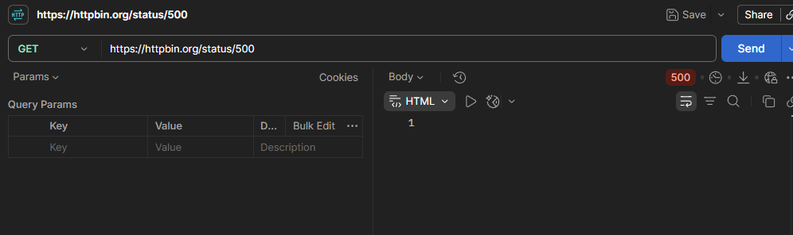

# Tugas Mandiri 2 — Memahami HTTP Status Code

## Tabel Hasil Pengujian Status Code

| Status Code | Arti | Hasil Pengujian | Kapan Digunakan |
| :---: | :--- | :--- | :--- |
| **200** | OK | Server mengembalikan status `200 OK` tanpa body respons. | Saat request berhasil diproses dan server mengembalikan data yang diminta. |
| **201** | Created | Server mengembalikan status `201 Created` tanpa body respons. | Saat request berhasil membuat sumber daya (*resource*) baru di server (misal: registrasi akun baru). |
| **400** | Bad Request | Server mengembalikan status `400 Bad Request` tanpa body respons. | Saat request dari client salah, seperti format JSON tidak valid atau parameter wajib yang hilang. |
| **401** | Unauthorized | Server mengembalikan status `401 Unauthorized` tanpa body respons. | Saat client mencoba mengakses endpoint yang terproteksi tanpa melampirkan autentikasi (misal: token/API key). |
| **403** | Forbidden | Server mengembalikan status `403 Forbidden` tanpa body respons. | Saat identitas client terverifikasi, tetapi tidak memiliki hak akses/izin untuk melihat data tersebut. |
| **404** | Not Found | Server mengembalikan status `404 Not Found` tanpa body respons. | Saat endpoint atau sumber daya (URL) yang diminta tidak ditemukan di server. |
| **500** | Internal Server Error | Server mengembalikan status `500 Internal Server Error` tanpa body respons. | Saat terjadi kesalahan atau *crash* internal pada kode pemrograman di sisi server. |

---

## Pertanyaan dan Jawaban

### 1. Apa perbedaan makna kode 400 dan 404? Berikan satu contoh keadaan untuk masing-masing kode.
* **Perbedaan Makna:**
  * **400 Bad Request:** Terjadi karena sintaks atau data request yang dikirimkan oleh client keliru/rusak.
  * **404 Not Found:** Terjadi karena endpoint atau lokasi URL yang dituju oleh client tidak ada di server[cite: 15, 16].
* **Contoh Keadaan:**
  * **Contoh 400:** Client melakukan *POST* data pengguna dengan format JSON yang rusak/salah sintaks (misal: kurang tanda kutip tutup `"` pada key JSON).
  * **Contoh 404:** Client mengakses URL `https://httpbin.org/status/9999` yang memang tidak terdaftar pada alur *route* server.

### 2. Apa perbedaan makna kode 401 dan 403 dalam pemeriksaan identitas dan hak akses pengguna?
* **401 Unauthorized (Masalah Autentikasi / Identitas):** Client belum terbukti siapa dirinya. Terjadi saat request tidak menyertakan kredensial autentikasi (seperti JWT Token atau API Key) yang valid[cite: 16].
* **403 Forbidden (Masalah Otorisasi / Hak Akses):** Server sudah tahu identitas client, tetapi client tersebut tidak memiliki level izin untuk melakukan tindakan tersebut[cite: 16]. Contoh: Pengguna dengan peran *Student* mencoba menghapus data di endpoint khusus *Admin*.

### 3. Mengapa 500 menunjukkan masalah pada sisi server?
Kode **500 Internal Server Error** merupakan kategori error *5xx* (Server Error)[cite: 14, 16]. Kode ini menandakan bahwa permintaan (*request*) yang dikirimkan oleh client sebenarnya sudah benar, namun terjadi kegagalan atau bug tidak terduga pada server saat memproses logika kode (seperti variabel bernilai *undefined/null*, gagal koneksi ke basis data, atau kelirunya kode backend)[cite: 16].

### 4. Apakah setiap respons kesalahan HTTP menunjukkan kerusakan pada server? Jelaskan alasan Anda dengan memberikan contoh.
**Tidak.** Kesalahan HTTP terbagi menjadi dua kategori utama[cite: 14, 16]:
1. **Error 4xx (Client Error):** Kerusakan atau kesalahan murni terjadi pada sisi client (pembuat request)[cite: 14, 16], bukan server. Contoh: Jika client mengakses URL yang salah (404)[cite: 15, 16] atau salah memasukkan kata sandi (401)[cite: 14, 16], server bekerja dengan sangat normal dalam menolak permintaan tersebut.
2. **Error 5xx (Server Error):** Hanya kategori inilah yang menandakan adanya kesalahan atau kerusakan pada sistem internal server[cite: 14, 16].

---

## Bukti Pengujian (Tangkap Layar Postman)

### 1. Pengujian Status 200 OK

### 2. Pengujian Status 404 Not Found

### 3. Pengujian Status 500 Internal Server Error

