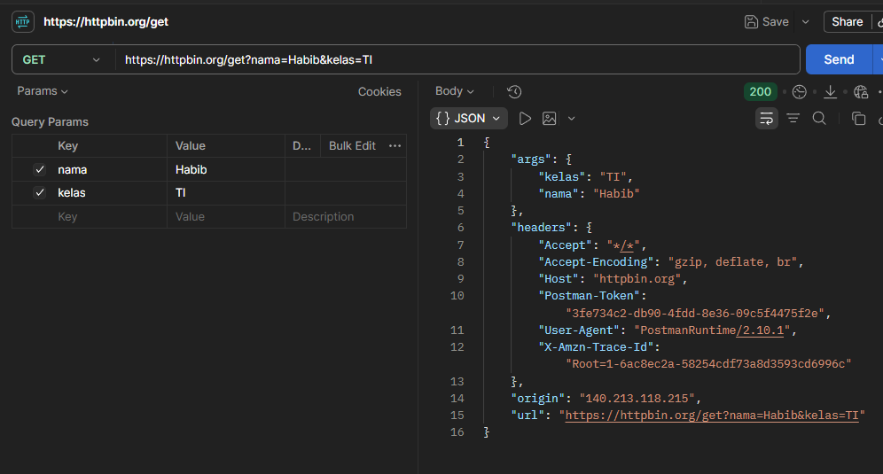
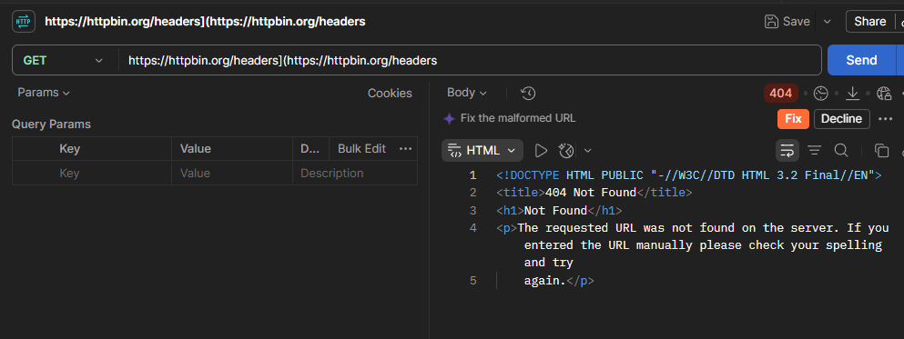

# Tugas Mandiri 3 — Memahami Request dan Response

## Tabel Rangkuman Pengujian Endpoint

| Endpoint | Method | Query Parameter / Header | Lokasi Data pada Respons |
| :--- | :---: | :--- | :--- |
| `https://httpbin.org/get?nama=Umar&kelas=TI` | GET | `nama=Umar`, `kelas=TI` | Terletak pada objek `args` di JSON respons |
| `https://httpbin.org/headers` | GET | Header Bawaan (e.g., `User-Agent`, `Host`) | Terletak pada objek `headers` di JSON respons |

---

## Jawaban Pertanyaan

### 1. Apa yang dimaksud dengan permintaan (request), dan pihak mana yang mengirimkannya?
**Permintaan (HTTP Request)** adalah pesan elektronik yang dikirim oleh *client* ke *server* untuk meminta informasi, menjalankan aksi, atau mengakses sumber daya tertentu. Pihak yang mengirimkannya adalah **Client** (seperti browser, aplikasi mobile, atau Postman).

### 2. Apa yang dimaksud dengan respons (response), dan pihak mana yang mengirimkannya?
**Respons (HTTP Response)** adalah pesan balasan yang dikirim oleh *server* kepada *client* sebagai jawaban atas permintaan yang diterima. Pihak yang mengirimkannya adalah **Server** (seperti web server atau API server).

### 3. Apa fungsi query parameter? Jelaskan menggunakan parameter `nama` dan `kelas` pada pengujian Anda.
**Fungsi query parameter** adalah untuk mengirimkan data tambahan berupa pasangan kunci-nilai (*key-value*) melalui URL, biasanya digunakan untuk memfilter, mengurutkan, atau mengidentifikasi data.
* **Penggunaan pada pengujian:**
  * Parameter `nama=Umar` memberitahu server bahwa nilai untuk kunci `nama` adalah `Umar`.
  * Parameter `kelas=TI` memberitahu server bahwa nilai untuk kunci `kelas` adalah `TI`.
  * Pada HTTPBin, data ini dipetakan dan dikembalikan di dalam objek `"args": { "kelas": "TI", "nama": "Umar" }`.

### 4. Apa fungsi HTTP header? Sebutkan satu header yang terlihat pada hasil pengujian dan jelaskan informasi yang dimuatnya.
**Fungsi HTTP header** adalah untuk membawa metadata/informasi konteks terkait permintaan atau respons, seperti jenis aplikasi *client*, format data, token keamanan, atau pengaturan *cache*.
* **Contoh Header:** `User-Agent`
* **Penjelasan:** Header ini memuat informasi mengenai identitas aplikasi client yang melakukan permintaan (misalnya `PostmanRuntime/7.x.x` atau versi browser), sehingga server mengetahui perangkat atau software apa yang sedang mengaksesnya.

### 5. Apa perbedaan penempatan data pada query parameter di URL dan pada body permintaan?
* **Query Parameter (di URL):** Data digabungkan langsung pada alamat URL setelah tanda tanya `?`. Data terlihat jelas secara transparan, terbatas pada string, dan kurang aman untuk data sensitif. Umumnya digunakan pada method `GET`.
* **Body Permintaan (Request Body):** Data disisipkan di dalam bagian badan pesan HTTP secara terpisah dari URL. Data tidak terlihat langsung di URL, mendukung struktur data kompleks (seperti JSON/File), dan jauh lebih aman untuk data sensitif. Umumnya digunakan pada method `POST`, `PUT`, atau `PATCH`.

---

## Bukti Pengujian (Tangkap Layar Postman)

### 1. Pengujian Endpoint `/get` (Query Parameter)

### 2. Pengujian Endpoint `/headers`

