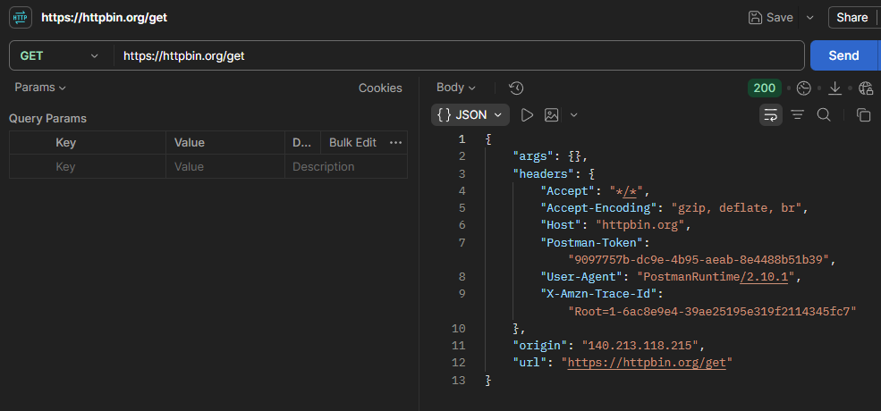
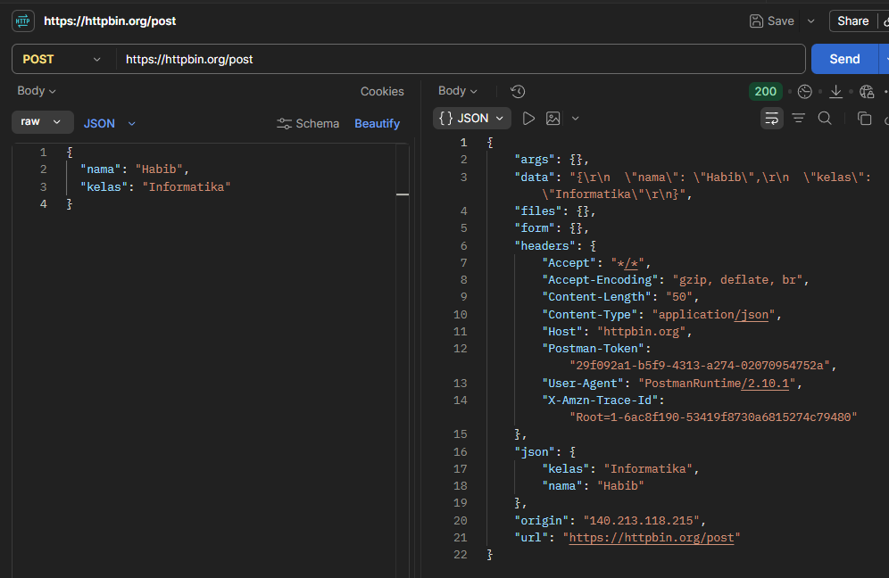
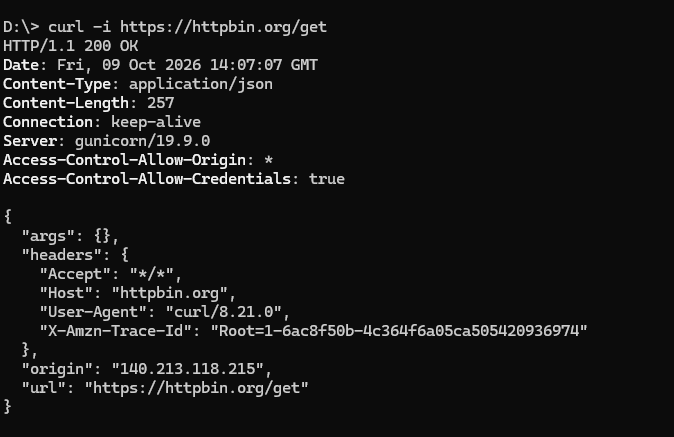
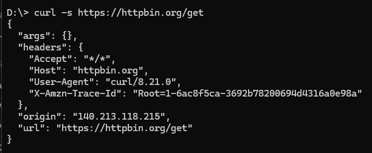

# Tugas Mandiri 4 — Pengujian API dengan Postman dan curl

## A. Analisis Hasil Pengujian Postman

### Perbandingan Respons GET vs POST
* **Pengujian GET (`https://httpbin.org/get`):** Respons menampilkan data yang dikirim melalui *query parameter* di dalam objek JSON pada bagian `"args"`.
* **Pengujian POST (`https://httpbin.org/post`):** Respons menampilkan data JSON yang dikirimkan di dalam *request body* (`{"nama": "Umar", "kelas": "Informatika"}`) pada bagian objek `"json"` dan `"data"`.

---

## B. Analisis Keluaran Perintah curl

### 1. `curl -i https://httpbin.org/get`
* **Hasil Keluaran:** Menampilkan **HTTP Response Header** lengkap (seperti versi HTTP `HTTP/1.1 200 OK`, `Content-Type: application/json`, dan `Content-Length`) yang diikuti langsung oleh *response body* berisi data JSON.

### 2. `curl -i https://httpbin.org/status/404`
* **Hasil Keluaran:** Menampilkan header status kesalahan `HTTP/1.1 404 NOT FOUND` dan `Content-Length: 0` tanpa ada isi *response body* di bawahnya.

---

## C. Membandingkan `curl -s` dan `curl -i`

Perbedaan utama kedua opsi terletak pada informasi yang disajikan di terminal: opsi `-i` (*include*) menyertakan seluruh HTTP Response Header (seperti status code, `Content-Type`, dan `Content-Length`) sebelum isi respons, sedangkan opsi `-s` (*silent*) menyembunyikan indikator progres dan error lalu hanya menampilkan *response body* murni tanpa header. Opsi `-s` sangat cocok digunakan saat ingin mengambil data murni (misalnya di dalam script/automation), sementara opsi `-i` digunakan saat proses debugging untuk memeriksa status code dan metadata header dari server.

---

## D. Bukti Pengujian (Tangkap Layar)

### 1. Permintaan GET melalui Postman

### 2. Permintaan POST melalui Postman

### 3. Perintah `curl -i`

### 4. Perintah `curl -s`
