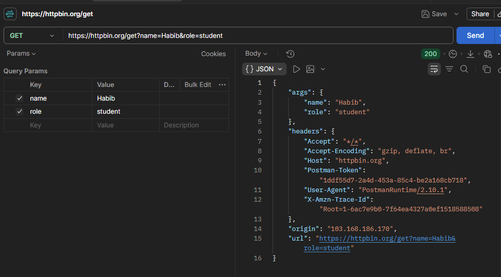
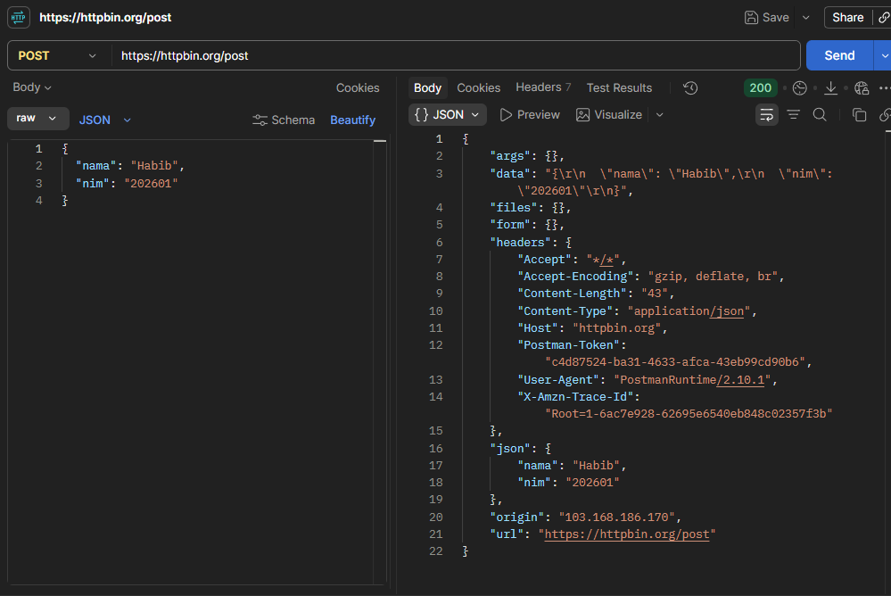

# Tugas Mandiri 1 — Mengenal HTTP Method dan Endpoint

## Tabel Rangkuman Hasil Pengujian

| No | Method | Endpoint | Data yang dikirim | Status | Hasil |
| :---: | :---: | :---: | :--- | :---: | :--- |
| 1 | GET | `/get` | Query parameter (`name=Habib&role=student`) | 200 OK | Server mengembalikan query parameter di dalam field `args` |
| 2 | POST | `/post` | JSON (`{"nama": "Habib", "nim": "202601"}`) | 200 OK | Server mengembalikan payload JSON di dalam field `json` dan `data` |
| 3 | PUT | `/put` | JSON (`{"nama": "Habib", "status": "updated"}`) | 200 OK | Server mengembalikan payload JSON pengganti di dalam field `json` |
| 4 | PATCH | `/patch` | JSON (`{"status": "active"}`) | 200 OK | Server mengembalikan payload JSON perubahan di dalam field `json` |
| 5 | DELETE | `/delete` | - | 200 OK | Server mengonfirmasi penghapusan tanpa menerima payload body |

---

## Rincian Pengujian Endpoint

### 1. Pengujian GET `/get`
* **HTTP Method:** GET
* **URL Lengkap:** `https://httpbin.org/get?name=Habib&role=student`
* **Tujuan Endpoint:** Menguji penerimaan permintaan GET dan membaca query parameter yang dikirimkan.
* **Data yang Dikirim:** Query Parameter `name=Habib&role=student`
* **Kode Status HTTP:** `200 OK`
* **Isi Respons (Response Body):**
```json
{
  "args": {
    "name": "Habib",
    "role": "student"
  },
  "headers": {
    "Host": "httpbin.org",
    "User-Agent": "PostmanRuntime/7.39.0"
  },
  "url": "[https://httpbin.org/get?name=Habib&role=student](https://httpbin.org/get?name=Habib&role=student)"
}
Penjelasan: Server HTTPBin mengembalikan seluruh detail request. Query parameter yang disisipkan pada URL tercermin langsung pada properti

# 2.Pengujian POST /post
- HTTP Method: POST  
- URL Lengkap: https://httpbin.org/post
- Tujuan Endpoint: Menguji penerimaan permintaan POST dan pengiriman data baru melalui body.
- Data yang Dikirim: JSON Body {"nama": "Habib", "nim": "202601"}
- Kode Status HTTP: 200 OK
- Isi Respons (Response Body):
{
  "args": {},
  "data": "{\n    \"nama\": \"Habib\",\n    \"nim\": \"202601\"\n}",
  "headers": {
    "Content-Type": "application/json"
  },
  "json": {
    "nama": "Habib",
    "nim": "202601"
  },
  "url": "[https://httpbin.org/post](https://httpbin.org/post)"
}
Penjelasan: Server membaca header Content-Type: application/json, lalu memuat kembali isi payload yang dikirimkan ke dalam properti json.


# 3. Pengujian PUT /put
- HTTP Method: PUT
- URL Lengkap: https://httpbin.org/put
- Tujuan Endpoint: Menguji pembaruan data secara menyeluruh (replacement) pada resource.
- Data yang Dikirim: JSON Body {"nama": "Habib", "status": "updated"}
- Kode Status HTTP: 200 OK
- Isi Respons (Response Body):
{
  "args": {},
  "headers": {
    "Content-Type": "application/json"
  },
  "json": {
    "nama": "Habib",
    "status": "updated"
  },
  "url": "[https://httpbin.org/put](https://httpbin.org/put)"
}
Penjelasan: Permintaan PUT berhasil diterima server dan seluruh payload JSON yang dikirimkan dipantulkan kembali pada field json.

#4. Pengujian PATCH /patch
- HTTP Method: PATCH   
- URL Lengkap: https://httpbin.org/patch
- Tujuan Endpoint: Menguji pembaruan data secara parsial (sebagian field saja). 
- Data yang Dikirim: JSON Body {"status": "active"}
- Kode Status HTTP: 200 OK
  [cite: 4, 5]
- Isi Respons (Response Body):
{
  "args": {},
  "headers": {
    "Content-Type": "application/json"
  },
  "json": {
    "status": "active"
  },
  "url": "[https://httpbin.org/patch](https://httpbin.org/patch)"
}
Penjelasan: Method PATCH menerima pembaruan sebagian data. Field yang dikirimkan pada body dikembalikan di dalam objek json oleh server.

#5. Pengujian DELETE /delete
- HTTP Method: DELETE[cite: 4, 5]
- URL Lengkap: https://httpbin.org/delete
  [cite: 3, 4]
- Tujuan Endpoint: Menguji permintaan penghapusan resource[cite: 4].
- Data yang Dikirim: Tidak ada data body (-)
- Kode Status HTTP: 200 OK
  [cite: 4, 5]
- Isi Respons (Response Body):
{
  "args": {},
  "data": "",
  "headers": {},
  "json": null,
  "url": "[https://httpbin.org/delete](https://httpbin.org/delete)"
}
Penjelasan: Permintaan DELETE dieksekusi tanpa memerlukan data body. Field json bernilai null dan data berupa string kosong.

## Bukti Pengujian (Tangkap Layar Postman)

### 1. Bukti Pengujian GET


### 2. Bukti Pengujian POST
